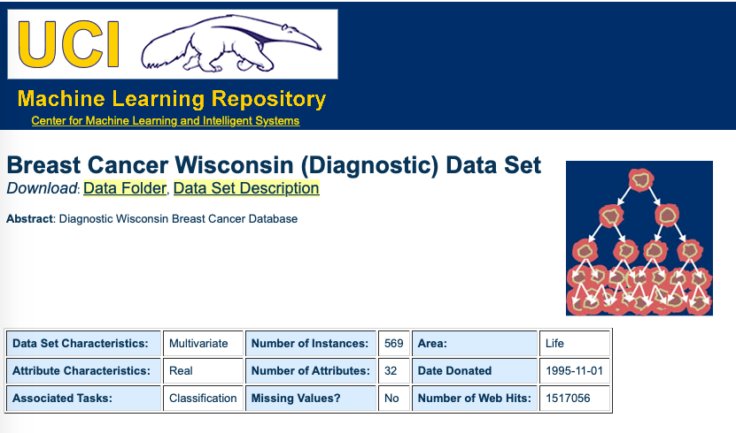

```{r setup, include=FALSE}
options(htmltools.dir.version = FALSE)
knitr::opts_chunk$set(
  fig.width=9, fig.height=3.5, fig.retina=3,
  out.width = "100%",
  cache = FALSE,
  echo = TRUE,
  message = FALSE, 
  warning = FALSE,
  fig.show = TRUE,
  hiline = TRUE
)
```


```{r xaringanExtra, echo=FALSE}
xaringanExtra::use_xaringan_extra(c("tile_view", "tachyons", "scribble", "editable", "panelset", "webcam", "freezeframe", "clipboard"))
xaringanExtra::use_extra_styles(
  hover_code_line = TRUE,         
  mute_unhighlighted_code = FALSE
)
xaringanExtra::use_logo(
  image_url = "imagens/CIA_logo.png"
)
```

```{r xaringan-themer, include=FALSE, warning=FALSE}
library(xaringanthemer)
style_xaringan()
```


## Um modelo intuitivo


```{r echo=FALSE, message=FALSE, warning=FALSE}
library(dplyr)
library(ggplot2)
uri <- "https://raw.githubusercontent.com/ctruciosm/ctruciosm.github.io/master/datasets/mini_iris.csv"
mini_iris <- read.csv(uri, sep = ";") %>% mutate_if(is.character,as.factor)  
ggplot(mini_iris) + geom_point(aes(Sepal.Length, Sepal.Width, color = Species))
```

--

O algoritmo **KNN** (k-vizinhos mais próximos) trabalha com essa mesma lógica! `r emo::ji("cool")`.

---
class: inverse, center, middle
# KNN
---

## KNN

.bg-washed-green.b--dark-green.ba.bw2.br3.shadow-5.ph4.mt5[
**k-Nearest Neighbors (kNN)** é um algoritmo supervisionado de _Machine/Statistical Learning_ em que a predição para uma nova observação, $x_0$, depende dos seus $k$-vizinhos mais próximos. 


O algoritmo atribuirá a observação $x_0$ ao grupo com maior frequência entre seus $k$-vizinhos mais próximos.
]


---

## KNN


```{r echo=FALSE, fig.height=5, fig.width=12, message=FALSE, warning=FALSE}
library(ggplot2)
library(patchwork)
set.seed(574)
dados = data.frame(
  x = rnorm(15, sd = 0.5),
  y = rt(15,6),
  grupo = sample(c("A", "B"), 15, replace = TRUE)
)
new_point = data.frame(x = 0, y = 0)
dados = dados %>%  mutate(d = sqrt((dados$x-new_point$x)^2 + 
(dados$y-new_point$y)^2)) %>% arrange(d)
p1 = ggplot(dados[1:5,]) + 
  geom_point(aes(x,y, color=grupo)) + 
  geom_point(data = new_point, aes(x,y)) +
    ggtitle("(a) 5-vizinhos mais próximos")
p2 = ggplot(dados[1:9,]) + 
  geom_point(aes(x,y, color=grupo)) + 
  geom_point(data = new_point, aes(x,y)) +
    ggtitle("(b) 9-vizinhos mais próximos")
p3 = ggplot(dados) + 
  geom_point(aes(x,y, color=grupo)) + 
  geom_point(data = new_point, aes(x,y)) +
    ggtitle("(c) 15-vizinhos mais próximos")
p1 + p2 + p3

```


---

## KNN: Primeiros passos


O _dataset_ `knn_exemplo` contém informações de 15 observações dividias em dois grupos (A e B) e está disponivel [aqui](https://raw.githubusercontent.com/ctruciosm/ctruciosm.github.io/master/datasets/knn_exemplo.txt):


#### Hands-on:

1. Importar os dados para o R 
2. Fazer um gráfico de dispersão (cada grupo que tenha diferente cor)
3. Utilizaremos o algoritmo KNN para classificar a nova observação `new_obs = data.frame(V1 = 0.7, V2 = 0.4)` em algum dos grupos (A ou B)

--

```{r, eval = FALSE}
# Importando os dados
library(dplyr)
uri <- "https://raw.githubusercontent.com/ctruciosm/ctruciosm.github.io/master/datasets/knn_exemplo.txt"
knn_exemplo <- read.table(uri, header = TRUE)
glimpse(knn_exemplo)
```

---

## KNN: Primeiros passos


```{r, echo = FALSE}
uri <- "https://raw.githubusercontent.com/ctruciosm/ctruciosm.github.io/master/datasets/knn_exemplo.txt"
knn_exemplo <- read.table(uri, header = TRUE)
```


.panelset[
.panel[.panel-name[Gráfico]

```{r, echo=FALSE}
library(ggplot2)
ggplot(knn_exemplo) + geom_point(aes(x = V1, y = V2, color= Grupo))
```

]

.panel[.panel-name[Código]

```{r, eval=FALSE}
library(ggplot2)
ggplot(knn_exemplo) + 
  geom_point(aes(x = V1, y = V2, color= Grupo))
```

]
]

---


## KNN: Primeiros passos

```{r}
# Carregando os pacotes
library(tidymodels)
library(kknn)
# Especificamos o modelo
knn_spec <- nearest_neighbor(neighbors = 5) %>% #<<
            set_engine("kknn") %>% 
            set_mode("classification") 
# Ajustamos o modelo (fit)
knn_fit <- knn_spec %>% 
           fit(factor(Grupo) ~ V1 + V2, data = knn_exemplo)
# Classificando new_obs (predict)
new_obs <- data.frame(V1 = 0.7, V2 = 0.4)
yhat <- predict(knn_fit, new_data = new_obs)
```

--

- Rodar o mesmo código mas com outro valor de $k$ (mudar o argumento `neighbors`). Os resultados são os mesmos?

--

```{r}
yhat
```


---

## KNN: Como o algoritmo funciona?


.pull-left[

.blue[

### Pseudocódigo

1. Escolher uma métrica $d(\cdot, \cdot)$ para medir a distância entre os pontos.
2. Calcular a distância do ponto a classificar $x_0$ a todos os pontos na amostra de treinamento $$d(x_0, x_i) \quad \forall i = 1, \cdots, n$$
3. Selecionar os $k$-vizinhos mais próximos a $x_0$  (aqueles $x_i$ com os $k$ menores valores de $d(x_0, x_i)$)
4. Classificar $x_0$ no grupo com maior frequência entre os $k$-vizinhos mais próximos
]
]

--

.pull-right[

### Exemplo

Sejam os pontos $P$ e $Q$ em que:

- $P = (p_1, \ldots, p_n)$
- $Q = (q_1, \ldots, q_n)$


A distância euclidiana entre $P$ e $Q$ é definida como: .red[$$d(P,Q) = \sqrt{(p_1-q_1)^2 + \cdots + (p_n-q_n)^2}$$]


No _dataset_ `knn_exemplo`, a nova observação é $x_0$ (`new_obs = data.frame(V1 = 0.7, V2 = 0.4)`), vamos a calcular as distâncias para entender como o algoritmo funciona.

]

---

## KNN: Como o algoritmo funciona?

```{r, echo = FALSE}
new_obs = data.frame(V1 = 0.7, V2 = 0.4)
knn_dist <- knn_exemplo %>% mutate(d = sqrt((knn_exemplo$V1-new_obs$V1)^2 + 
(knn_exemplo$V2-new_obs$V2)^2)) %>% arrange(d)
knitr::kable(knn_dist)
```

---
class: inverse, center, middle
# KNN: Case
---

## KNN: Case




--

Para mais _datasets_ para praticar, podem entrar no _UCI Machine Learning Repository_ [aqui](http://archive.ics.uci.edu/ml/datasets.php)


---

## KNN: Case


.panelset[
.panel[.panel-name[Importando dados]

```{r, eval = FALSE}
# Importando os dados
uri <- "http://archive.ics.uci.edu/ml/machine-learning-databases/breast-cancer-wisconsin/wdbc.data"
data <- read.table(uri, sep=",")
glimpse(data)
```
]

.panel[.panel-name[Pré-processamento]

```{r, eval = FALSE}
data <- data %>% select(-V1) %>% rename(Diagnostico = V2) %>% na.omit()
dim(data)
```
]

.panel[.panel-name[Splitting data]

```{r, eval = FALSE}
# Spliting data
set.seed(1234) #<<
data_split <- initial_split(data, prop = 3/4, strata = Diagnostico)
train_data <- training(data_split)
test_data <- testing(data_split)
x_test_data <- test_data %>% select(-Diagnostico)
y_test_data <- test_data %>% select(Diagnostico)
```
]

.panel[.panel-name[KNN]
```{r, eval = FALSE}
library(tidymodels)
library(kknn)
# Especificamos o modelo
knn_spec <- nearest_neighbor(neighbors = 5) %>% #<<
            set_engine("kknn") %>% 
            set_mode("classification") 
# Ajustamos o modelo (fit)
knn_fit <- knn_spec %>% 
           fit(factor(Diagnostico) ~ ., data = train_data)
# Clasificando as novas observações (predict)
yhat_test <- predict(knn_fit, new_data = x_test_data)
table(yhat_test$.pred_class,y_test_data$Diagnostico)

```
]

.panel[.panel-name[Avaliando o modelo]

```{r, echo=FALSE}
uri <- "http://archive.ics.uci.edu/ml/machine-learning-databases/breast-cancer-wisconsin/wdbc.data"
data <- read.table(uri, sep=",")
data <- data %>% select(-V1) %>% rename(Diagnostico = V2) %>% na.omit()
set.seed(1234) 
data_split <- initial_split(data, prop = 3/4, strata = Diagnostico)
train_data <- training(data_split)
test_data <- testing(data_split)
x_test_data <- test_data %>% select(-Diagnostico)
y_test_data <- test_data %>% select(Diagnostico)
knn_spec <- nearest_neighbor(neighbors = 5) %>% set_engine("kknn") %>% set_mode("classification") 
knn_fit <- knn_spec %>% fit(factor(Diagnostico) ~ ., data = train_data)
yhat_test <- predict(knn_fit, new_data = x_test_data)
table(yhat_test$.pred_class,y_test_data$Diagnostico)
```


- A matriz acima é conhecida como matriz de confusão e nos da informação sobre que tão bem foi feita a classificação. No futuro entraremos em maior detalhes sobre essa matriz.
- Por agora, nos preocuparemos unicamente em maximizar a soma dos elementos da diagional .blue[(observações corretamente classificadas).]


]
]


---

## KNN: Como escolher K?

- Uma forma é utilizando _cross-validation_ (veremos isto no futuro) 
- Peña (2002) sugere utilizar $k = \sqrt{n_g},$ em que $n_g$ é o tamanho médios dos grupos.

```{r, eval=FALSE}
table(train_data$Diagnostico)
m = floor(sqrt(mean(table(train_data$Diagnostico))))
knn_spec <- nearest_neighbor(neighbors = m) %>% set_engine("kknn") %>% set_mode("classification") 
# Ajustamos o modelo (fit)
knn_fit <- knn_spec %>% fit(factor(Diagnostico) ~ ., data = train_data)
yhat_test <- predict(knn_fit, new_data = x_test_data)
table(yhat_test$.pred_class,y_test_data$Diagnostico)
```


---


                  
## Data-Tips:


.pull-left[ 

]
.pull-right[

- Utilize outros conjuntos de dados do [UCI Machine Learning Repository](http://archive.ics.uci.edu/ml/datasets.php)

- A implementação do kknn utiliza a distância de Minkowski (p = 2), se as variáveis estiverem em unidades de medida diferentes não calculará a distância de forma _justa_. Neste caso uma boa opção é padronizar as variáveis (fácil) ou utilizar a distância de Mahalanobis (não implementada no kknn mas em outros pacotes do R).

Minkowski: 
.red[$$d(P,Q) = \Big(|p_1-q_1|^p + \cdots + |p_n-q_n|^p \Big)^{1/p}$$]

Mahalanobis: Seja $S$ a matriz de covariância entre $P$ e $Q$,
.red[$$d(P,Q) = \sqrt{(P-Q)'S^{-1}(P-Q)}$$]

]


---

## Referências:


 
- Peña, D. (2002). Análisis de datos multivariantes. Madrid: McGraw-hill. Capítulo 14.5.3
- [James, G., Witten, D., Hastie, T., and Tibshirani, R. (2013). An Introduction to Statistical Learning with Applications in R. New York: Springer.](https://www.statlearning.com) Chapter 2
- [Chatzidimitriou, K., Diamantopoulos, T., Papamichail, M., and Symeonidis, A. (2018). Practical Machine Learning in R. Leanpub.](https://leanpub.com/practical-machine-learning-r) Chapter 5


## Nota

Aqui temos visto o algoritmo KNN para classificação. Contudo, pode também ser utilizado para problemas de regressão.
