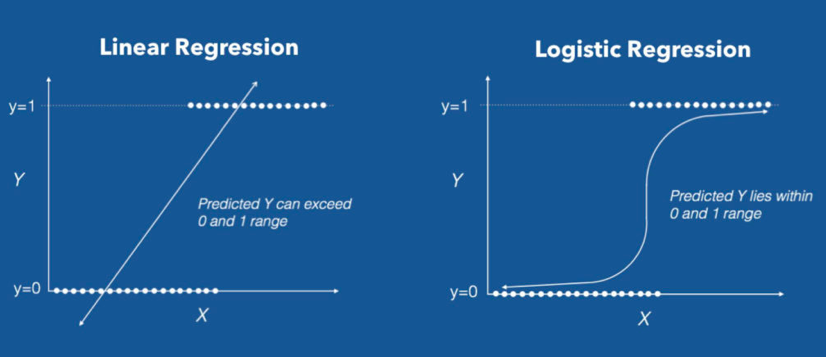

```{r setup, include=FALSE}
options(htmltools.dir.version = FALSE)
knitr::opts_chunk$set(
  fig.width=9, fig.height=3.5, fig.retina=3,
  out.width = "100%",
  cache = FALSE,
  echo = TRUE,
  message = FALSE, 
  warning = FALSE,
  fig.show = TRUE,
  hiline = TRUE
)
```


```{r xaringanExtra, echo=FALSE}
xaringanExtra::use_xaringan_extra(c("tile_view", "tachyons", "scribble", "editable", "panelset", "webcam", "freezeframe", "clipboard"))
xaringanExtra::use_extra_styles(
  hover_code_line = TRUE,         
  mute_unhighlighted_code = FALSE
)
xaringanExtra::use_logo(
  image_url = "imagens/CIA_logo.png"
)
```

```{r xaringan-themer, include=FALSE, warning=FALSE}
library(xaringanthemer)
style_xaringan()
```


## Intuição

Quando trabalhamos com um modelo de regressão linear, estamos interessados em relações do tipo $$y = \beta_0 + \beta_1 x_1 + \cdots + \beta_k x_k + u,$$

$$E(y|X) = \beta_0 + \beta_1 x_1 + \cdots + \beta_k x_k$$


--

Imagine agora que:

- Estamos ante um problema de classificação (y: 0 ou 1),

--

- Em lugar de modelar $Y$, queremos modelar $P(Y=1|X) = p(X)$ 

--

- Classificamos uma nova observação $x_0$ na classe 1 se, por exemplo $P(Y=1|x_0) > 0.5$

--

- Como modelar $P(Y=1|X) = p(X)$?


---
class: inverse, center, middle
# Regressão Logística
---


## Regressão Logística


### Como modelar $p(X)$?


--


.pull-left[ 

$$p(X) = \beta_0 + \beta_1 X_1 + \cdots + \beta_k X_k$$

- Conhecido como o modelo de probabilidade linear
- Quando $y = 0 \text{ ou } 1$, $\underbrace{E(y|X)}_{P(Y=1|X) := p(X)} = \beta_0 + \beta_1 X_1 + \cdots + \beta_k X_k$
- Pode produzir valores fora do $[0,1]$]


--


.pull-right[

$$p(X) = \dfrac{e^{\beta_0 + \beta_1 X_1 + \cdots + \beta_k X_k}}{1+e^{\beta_0 + \beta_1 X_1 + \cdots + \beta_k X_k}}$$
- Utiliza a função logística para evitar os problemas que apresenta o modelo de probabilidade linear
- $f(x) = \dfrac{e^x}{1+e^x}$
- Os valores de $p(X)$ estarão sempre no intervalo $[0,1]$

]


---

## Regressão Logística


.center[
```{r , fig.cap="Probabilidade Linear vs. Regressão Logística. Source: /www.machinelearningplus.com", echo=FALSE, out.width = '80%'}

```
]


---
class: inverse, center, middle
# Regressão Logística no R
---


## Regressão Logística no R

O _dataset_ `Default` do pacote `ISLR` contém informações de 10,000 indivíduos. Estas informações são referentes à renda (income), balance bancario (balance), se é estudante ou não (student) e se entrou em default ou não (default) no banco.

```{r}
#install.packages("ISLR")
#install.packages("tidyverse")
library(ISLR)
library(tidyverse)
glimpse(Default)
```


--


.blue[Com base nestas informações queremos construir um modelo preditivo que nos auxilie na decisão da conceder (ou não) crédito a um determinado indivíduo.]

---

## Regressão Logística no R


.panelset[

.panel[.panel-name[Splitting data]

```{r}
library(rsample)
set.seed(321) 
data_split <- initial_split(Default, prop = 3/4, strata = default)
train_data <- training(data_split)
test_data <- testing(data_split)
```

.red[Obs:] Para que serve o argumento `strata`?

]

.panel[.panel-name[Forma fácil]

```{r}
# Treinamos o modelo SEMPRE utilizando os train_data
modelo <- glm(default ~ student + balance + income, data = train_data,
              family = "binomial") #<<
yhat_prob <- predict(modelo, newdata = test_data, type = "response")
yhat_test <- ifelse(yhat_prob < 0.5, "No", "Yes")
table(test_data$default,yhat_test)
```

O modelo teve `r sum(diag(table(test_data$default,yhat_test)))/sum(table(test_data$default,yhat_test))*100`% das novas observações corretamente classificadas.

]

.panel[.panel-name[Tidymodels]

```{r}
library(tidymodels)
model_spec <- logistic_reg() %>% 
              set_engine("glm")
model_fit <- model_spec %>% 
             fit(default ~ student + balance + income, data = train_data)
yhat_test <- predict(model_fit, new_data = test_data)
test_data$yhat <- yhat_test$.pred_class  #<<
table(test_data$default,test_data$yhat)
test_data %>% accuracy(default, yhat)

```

]]


---

## Regressão Logística no R

```{r, eval=FALSE}
# Split
data_split <- initial_split(Default, prop = 3/4, strata = default)
train_data <- training(data_split)
test_data <- testing(data_split)
# Fit
model_spec <- logistic_reg() %>% set_engine("glm")
model_fit <- model_spec %>% fit(default ~ student + balance + income, data = train_data)
# Predict
test_data$yhat <- predict(model_fit, new_data = test_data)$.pred_class
# Evaluate
test_data %>% accuracy(default, yhat)
```

#### .red[Hands-on:]

O _dataset_ `Smarket` do pacote `ISLR` contem 1250 observações com observações sobre os retornos financeiros de uma determinada ação. `Today` corresponde ao retorno observado no dia $t$ e `Direction` aponta se o preço da ação subiu (Up) ou caiu (Down) com respeito ao preço do dia anterior.

Queremos um modelo preditivo que, com base na informação contida nas variáveis `Volume`, `Lag1`, `Lag2`, `Lag3`, `Lag4` e `Lag5`, nos diga se o preço da ação vai subir ou cair.


```{r, echo = FALSE}
library(countdown)
countdown(minutes = 5, seconds = 0, bottom = 0)
```


---


## Data-Tips:


.pull-left[ 

]


.pull-right[

- Knn é outro metodo de classificação, compare knn e regressão logística nos problemas estudados com os _datasets_ `Default`, `Smarket`. 
- Além da accurácia, existem outras medidas para avaliar nossa classificação, pesquise e saiba quais são.
- E se tivermos mais de duas categorias? Podemos tambem utilizar regressão logistica (utilizará a distribuição multinomial por trás dos panos)
- Temos estudados apenas a parte introdutória da regressão logística, um estudo detalhado dela (e outros modelos lineares generalizados) podem ser obtidos no livro [Foundations of Linear and Generalized Linear Models,](Foundations of Linear and Generalized Linear Models) do [Alan Agresti](http://users.stat.ufl.edu/~aa/).


]


---

## Referências:

 
- [James, G., Witten, D., Hastie, T., and Tibshirani, R. (2013). An Introduction to Statistical Learning with Applications in R. New York: Springer.](https://www.statlearning.com) Chapter 3

