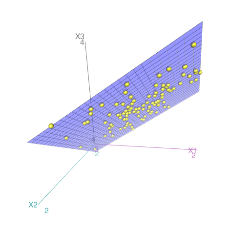
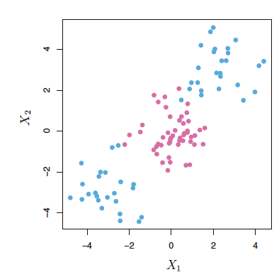
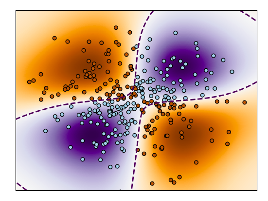
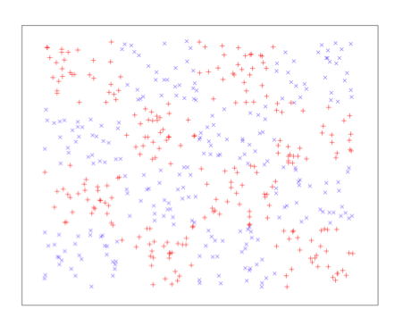

layout: true

<a class="footer-link" href="http://ctruciosm.github.io">ctruciosm.github.io &mdash; Carlos Trucíos (FACC/UFRJ)</a>

---


```{r setup, include=FALSE}
options(htmltools.dir.version = FALSE)
knitr::opts_chunk$set(
  fig.width = 9, fig.height = 3.5, fig.retina = 3,
  out.width = "100%",
  cache = FALSE,
  echo = TRUE,
  message = FALSE, 
  warning = FALSE,
  fig.show = TRUE,
  hiline = TRUE
)
```


```{r xaringanExtra, echo=FALSE}
xaringanExtra::use_xaringan_extra(c("tile_view", "tachyons", "scribble", "editable", "panelset", "webcam", "freezeframe", "clipboard"))
xaringanExtra::use_extra_styles(
  hover_code_line = TRUE,         
  mute_unhighlighted_code = FALSE
)
xaringanExtra::use_logo(
  image_url = "imagens/CIA_logo.png"
)
```

```{r xaringan-themer, include=FALSE, warning=FALSE}
library(xaringanthemer)
style_xaringan()
```

## Introdução

- Desenvolvido pelo pessoal da computação (1990s)

--

- Funciona tanto se os grupos são linearmente separáveis ou não.

--


  
---
class: inverse, right, middle
# SVM
---

### SVM: Definições básicas


**Hiperplano:** em um espaço de dimensão $p$, um hiperplano é um subespaço de dimensão $p-1$. Em termos matemáticos, um hiperplano é definido por $$\beta_0 + \beta_1 X_1 + \beta_2 X_2 + \cdots + \beta_p X_p = 0$$

--


```{r, echo = FALSE, message=FALSE, warning=FALSE}
library(ggplot2)
library(car)
```


.panelset[
.panel[.panel-name[p = 2]

$$\underbrace{\beta_0}_{-0.7} + \underbrace{\beta_1}_{0.6} X_1 + \underbrace{\beta_2}_{-1} X_2= 0$$
```{r, echo=FALSE, out.width = '50%'}
beta0 = -0.7
beta1 = 0.6
beta2 = -1
X1 = rnorm(100)
X2 = beta0 + beta1*X1
hiperplano1 = data.frame(X1, X2)
ggplot(hiperplano1) + geom_line(aes(X1, X2))
```
]
.panel[.panel-name[p = 3]
$$\underbrace{\beta_0}_{0} + \underbrace{\beta_1}_{1} X_1 + \underbrace{\beta_2}_{1} X_2 + \underbrace{\beta_3}_{-1} X_3= 0$$
```{r, echo=FALSE, eval=FALSE}
beta0 = 0
beta1 = 1
beta2 = 1
beta3 = -1
X1 = rnorm(100)
X2 = rnorm(100)
X3 = beta0 + beta1*X1 + beta2*X2
hiperplano2 = data.frame(X1, X2, X3)
scatter3d(X3 ~ X1 + X2, data = hiperplano2)
```

```{r echo=FALSE, out.width = '25%'}

```

]
]


---

### SVM: Intuição

.center[

```{r echo=FALSE, out.width = '35%'}

```

]
--

E se utilizarmos o hiperplano para dividir as observações que caem acima/abaixo dele?

--

Essa é a ideia do SVM (porém, bem mais complexa pois não precisa que a separação seja linear).


---

### SVM: Intuição

.center[
```{r, echo=FALSE, out.width = '60%'}
set.seed(123)
beta0 = -0.7
beta1 = 0.6
beta2 = -1
X1 = rnorm(100)
X2 = beta0 + beta1*X1
hiperplano1 = data.frame(X1, X2)
ggplot(hiperplano1) + geom_line(aes(X1, X2))
```
]

--

Como escolhemos o melhor hiperplano? (reta, no caso)

--

Um critério é maximizar a distância mínima do ponto ao hiperplano! 

--

.blue[Ou seja, queremos encontrar os] $\beta$s .blue[que nos levam a esse hiperplano que maximiza a distância mínima do ponto ao hiperplano.]


---

### SVM: Intuição

.center[
```{r, echo=FALSE, out.width = '60%'}
set.seed(123)
beta0 = -0.7
beta1 = 0.6
beta2 = -1
X1 = rnorm(100)
X2 = beta0 + beta1*X1
hiperplano1 = data.frame(X1, X2)
ggplot(hiperplano1) + geom_line(aes(X1, X2))
```
]

--

Essas três pontos nas margens são chamados de _support vectors_ pois são vetores na dimensão $p$ e porque suportam o hiperplano que maximiza a distância mínima do ponto ao hiperplano.


--

Infelizmente, esse hiperplano não sempre existe (ou mesmo que existe não sempre é desejável).

--

Mas podemos tentar achar outro tipo de hiperplanos. Por exemplo, podemos permitir que algumas observações  estejam do lado errado do hiperplano /  margens.


---

### SVM

Muitas vezes, lidamos com casos em que um solução linearmente separável não é uma boa opção:


.panelset[
.panel[.panel-name[Caso 1]
.center[
```{r echo=FALSE, out.width = '35%'}

```
]
]
.panel[.panel-name[Caso 2]
.center[
```{r echo=FALSE, out.width = '35%'}

```
]
]
.panel[.panel-name[Caso 3]
.center[
```{r echo=FALSE, out.width = '35%'}

```
]
]
]

---

## SVM


**Possíveis soluções:**

- Incluir termos polinomiais como variáveis explicativas: $X^2, X^3,...$ (a mesma idea quando trabalhamos com regressão linear).

--

- Outra forma de lidar com essa não lineariedade é através de Kernels!!!!

--

- **Kernels** são funções que quantificam a similaridade de dois observações.

--

No caso linear, basicamente classificamos uma observação dependendo de ela cai acima/abaixo do hiperplano: $$f(x) = \beta_0 + \underbrace{\beta_1 x_1 + \beta_2 x_2 + \cdots + \beta_k x_k}_{x' \beta}$$


---
class: inverse, right, middle
# Implementação no R
svm_poly e svm_rbf
---

## Implementação no R

.panelset[

.panel[.panel-name[Splitting data]

```{r}
library(tidymodels)
library(mlbench)
data(BreastCancer)
BreastCancer <- BreastCancer %>% select(-Id) %>% drop_na()
set.seed(123) 
data_split <- initial_split(BreastCancer, prop = 3/4, strata = Class)
train_data <- training(data_split)
test_data <- testing(data_split)
```
]

.panel[.panel-name[Reg. Logistica]
```{r}
model_spec <- logistic_reg() %>% 
              set_mode("classification") %>%
              set_engine("glm")
model_fit <- model_spec %>% 
             fit(Class ~ ., data = train_data)
augment(model_fit, new_data = test_data) %>%
  accuracy(truth = Class, estimate = .pred_class)
```
]
.panel[.panel-name[SVM Linear]
```{r}
model_spec <- svm_poly(degree = 1) %>% 
              set_mode("classification") %>%
              set_engine("kernlab", scaled = FALSE)
model_fit <- model_spec %>% 
             fit(Class ~ ., data = train_data)
augment(model_fit, new_data = test_data) %>%
  accuracy(truth = Class, estimate = .pred_class)
```
]
.panel[.panel-name[SVM Linear]
```{r}
model_spec <- svm_poly(degree = 1) %>% 
              set_mode("classification") %>%
              set_engine("kernlab", scaled = FALSE)
model_fit <- model_spec %>% set_args(cost = 10) %>% 
             fit(Class ~ ., data = train_data)
augment(model_fit, new_data = test_data) %>%
  accuracy(truth = Class, estimate = .pred_class)
```
]

.panel[.panel-name[SVM Poly 2]
```{r}
model_spec <- svm_poly(degree = 2) %>% 
              set_mode("classification") %>%
              set_engine("kernlab", scaled = FALSE)
model_fit <- model_spec %>% 
             fit(Class ~ ., data = train_data)
augment(model_fit, new_data = test_data) %>%
  accuracy(truth = Class, estimate = .pred_class)
```
]
.panel[.panel-name[SVM RBF]
```{r}
model_spec <- svm_rbf() %>% 
              set_mode("classification") %>%
              set_engine("kernlab", scaled = FALSE)
model_fit <- model_spec %>% 
             fit(Class ~ ., data = train_data)
augment(model_fit, new_data = test_data) %>%
  accuracy(truth = Class, estimate = .pred_class)
```
]
]


---


## Data-Tips:


.pull-left[ 
```{r echo=FALSE, out.width = '70%'}
knitr::include_graphics("https://octodex.github.com/images/minertocat.png")
```
]


.pull-right[

- Temos utilizado apenas os valores padrão implementados no SVM.
- Aprenda como _tunar_ parametros utilizando o pacote `tidymodels`. Dica: visite a [documentação](https://www.tidymodels.org/find/parsnip/#models) ou faça `args(rand_forest)`/ `args(boost_tree)` para saber quais hiperparâmetros podem ser tunados.


**Happy Coding!**


### Referências

- [James, G., Witten, D., Hastie, T., and Tibshirani, R. (2013). An Introduction to Statistical Learning with Applications in R. New York: Springer.](https://www.statlearning.com) Chapter 9


- [Chatzidimitriou, K., Diamantopoulos, T., Papamichail, M., and Symeonidis, A. (2018). Practical Machine Learning in R. Leanpub.](https://leanpub.com/practical-machine-learning-r) Chapter 6


]


