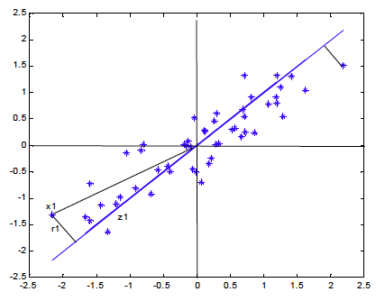

layout: true

<a class="footer-link" href="http://ctruciosm.github.io">ctruciosm.github.io &mdash; Carlos Trucíos (FACC/UFRJ)</a>

---


```{r setup, include=FALSE}
options(htmltools.dir.version = FALSE)
knitr::opts_chunk$set(
  fig.width = 9, fig.height = 3.5, fig.retina = 3,
  out.width = "100%",
  cache = FALSE,
  echo = TRUE,
  message = FALSE, 
  warning = FALSE,
  fig.show = TRUE,
  hiline = TRUE
)
```


```{r xaringanExtra, echo=FALSE}
xaringanExtra::use_xaringan_extra(c("tile_view", "tachyons", "scribble", "editable", "panelset", "webcam", "freezeframe", "clipboard"))
xaringanExtra::use_extra_styles(
  hover_code_line = TRUE,         
  mute_unhighlighted_code = FALSE
)
xaringanExtra::use_logo(
  image_url = "imagens/CIA_logo.png"
)
```

```{r xaringan-themer, include=FALSE, warning=FALSE}
library(xaringanthemer)
style_xaringan()
```

## Introdução

- Nas reuniões anteriores estudamos métodos de aprendizado de máquina **supervisionados**, ou seja, temos uma variável _target_ $Y$ e um conjunto de variáveis explicativas $X$'s

--

- Existem também métodos **não supervisionadoss**, cujo foco é extrair relações do conjunto de variáveis $X$'s. 

--

- Nos métodos **não supervisionados**, não existe variável _target_ $Y$, apenas $X$'s.


--


- Estudaremos o método de **componentes principais**, cujo foco é resumir a informação contida nas $p$ variáveis explicativas ( $X_1, \ldots, X_p$) em um conjuno de poucas novas variáveis (componentes) não correlacionadas que capturam a maior parte da variabilidade dos dados.


  
---
class: inverse, right, middle
# Análise de Componentes Principais
---

### Análise de Componentes Principais


.bg-washed-green.b--dark-green.ba.bw2.br3.shadow-5.ph4.mt5[
The central idea of principal component analysis (PCA) is to reduce the dimensionality of a data set consisting of a large number of interrelated variables, while retaining as much as possible of the variation present in the date set. This is achieved by transforming to a new set of variables, the principal components (PCs), which are uncorrelated, and which are ordered so that the first few retain most of the variation present in all of the original variables.
.tr[
— Jolliffe (2012), Principal Component Analysis, 2nd edition.
]]


--

- É uma técnica de redução de dimensão
- Transforma um conjunto de variáveis (variáveis originais) em um novo conjunto de variáveis não correlacionadas (componentes)
- As componentes são obtidas de forma que capturem a maior parte da variabilidade  total dos dados em apenas poucas componentes
- O número total de componentes é igual ao número de variáveis originais (porém, já as primeiras componentes capturam a maioria da variabilidade dos dados).
- Cada componente é uma combinação linear de todas as variáveis originais
- Para que ACP tenha sentido é necessário que as variáveis originais sejam correlacionadas.


---

### Obtenção das componentes

**Objetivo:** Encontrar $r$ componentes ($r < p$) de forma que obtenhamos a maior parte da informação dos dados.

<center>


```{r echo=FALSE, out.width = '50%'}

```

</center>


---

### Obtenção das componentes

Seja $X$ uma matriz (centrada) com $N$ colunas e $T$ linhas.

--

Seja o i-ésimo elemento da primeira componente: $$Z_{i1} = \phi_{11} X_{i1} + \phi_{12} X_{i2} + ... + \phi_{1N} X_{iN} \quad i = 1, ..., T.$$

--


Estamos interessados em obter $\phi_1$ de forma que $Var(Z_1)$ seja máxima (sujeito a certas restrições).

--

Reescrevendo em forma matricial temos $$Z_1 = X_{T \times N} \phi_{1,N \times 1}$$

--

$$Var(Z_1) = \frac{1}{T}Z_1'Z_1 = \dfrac{1}{T} \phi_1' X'X \phi_1 = \phi_1'\Sigma \phi_1$$ em que $\Sigma$ é a matriz de covariância dos dados originais


---

### Obtenção das componentes

Queremos maximizar $Var(Z_1)$ sujeito a $\phi_1'\phi_1 = 1$. Então, $$L = \phi_1'\Sigma \phi_1 - \lambda (\phi_1'\phi_1 -1)$$

--


Derivando w.r.t $\phi_1$ temos: $$\dfrac{\partial L}{\partial \phi_1} = 2 \Sigma \phi_1 - 2 \lambda \phi_1$$


--


Igualando a zero: $$\Sigma \phi_1 = \lambda \phi_1.$$


--


> Ou seja,  $\phi_1$ é o autovetor associado ao autovalor $\lambda$.


--

Para que $$Var(Z_1) = \phi_1'\Sigma \phi_1 = \phi_1' \lambda \phi_1 = \lambda \phi_1'\phi_1 = \lambda$$ seja máxima, $\lambda$ deve ser o maior autovalor. Logo, $\phi_1$ é o autovetor associado ao maior autovalor.


---

### Obtenção das componentes


Nas componentes restante, estamos interessados em obter $$Z_j = X \phi_j$$ em que $\phi_j$ é escolhido para maximizar $Var(Z_j)$ dado que $\phi_j'\phi_j = 1$ e $\phi_j'\phi_k = 0 \quad \forall k\neq j$.

--

Seguindo um procedimento semelhante ao anterior temos que $$\Sigma u_j = \lambda_j u_j$$ Logo, o vetor $\phi_j$ que maximiza $Var(Z_j) = \lambda_j$ é o autovetor associado ao j-ésimo maior autovalor. 


---

### Obtenção das componentes


.bg-washed-green.b--dark-green.ba.bw2.br3.shadow-5.ph4.mt5[
Obter as componentes principais resume-se a um problema de calcular autovalores-autovetores da matriz de covariância.
]

--

**Pseudo Algoritmo:**


- Estimar a matriz de covariância $\widehat{\Sigma}$ 
- Decompor $\widehat{\Sigma}$ em autovalores e autovetores $$\widehat{\Sigma} M = M \Lambda$$em que $\Lambda$ é uma matriz diagonal de autovalores ordenados de maior a menor e $M$ a matriz de autovetores assoaciados aos autovalores
- Calcular as componentes proncipais através de $Z = X\times M$


---
class: inverse, right, middle
# ACP no R
---


### ACP no R

Embora implementar ACP desde zero não é uma tarefa dificil, existem pacotes que faciliam nossa vida.


--

O _dataset_ `USArrests` do pacote `ISLR` traz informações de 4 variáveis referentes a crimes no Estados Unidos.
```{r}
library(ISLR)
library(dplyr)
glimpse(USArrests)
cp <- princomp(USArrests, cor = TRUE)
```

--

O objeto `cp` contém várias informações (faça `str(cp)` pra verificar). Se quisermos unicamente as novas variáveis, faça `cp$scores`


---
### ACP no R


```{r}
cp$scores
```


---
### Número de Componentes


-  **Critério de Kaisser:** Utilizamos tantas componentes quanto autovalores satisfazendo maiores do que 1 $\lambda_i > 1$.


```{r, eval = FALSE}
plot(cp)
abline(h = 1, col = "red")
```

<center>


```{r, echo = FALSE}
plot(cp)
abline(h = 1, col = "red")
```

</center>


---
### Número de Componentes

- **Até atingir um mínimo de variância explicada pela componentes**

```{r}
summary(cp)
```

---

### Comentários

1. Para evitar que o efeito escala da variável influencia na ACP, é preferível utilizar `cor = TRUE`. Utilizar `cor = TRUE` é equivalente a primeiro padronizar cada uma das variáveis para ter variância 1.
2. Se estamos interessados em interpretar as componentes, basta olhar para a correlação entre as variáveis e as componentes.
3. As componentes obtidas são não correlacionadas 
```{r}
cor(cp$scores)
```


---


## Data-Tips:


.pull-left[ 
```{r echo=FALSE, out.width = '70%'}
knitr::include_graphics("https://octodex.github.com/images/minertocat.png")
```
]


.pull-right[

ACP pode ser utilizado para criar indicadores, reducir o número de variáveis a serem utilizadas em um método supervisionado ou com fins de visualização de dados.


#### Referências

- [James, G., Witten, D., Hastie, T., and Tibshirani, R. (2013). An Introduction to Statistical Learning with Applications in R. New York: Springer.](https://www.statlearning.com) Chapter 10


]


